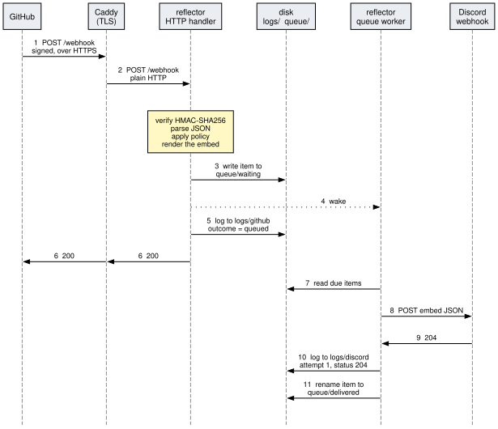
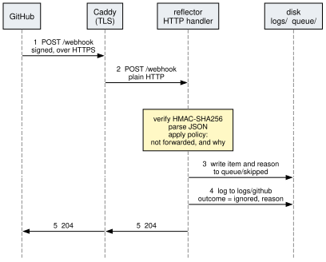
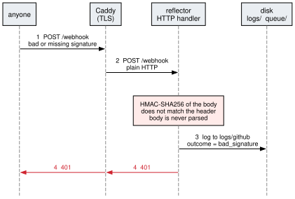
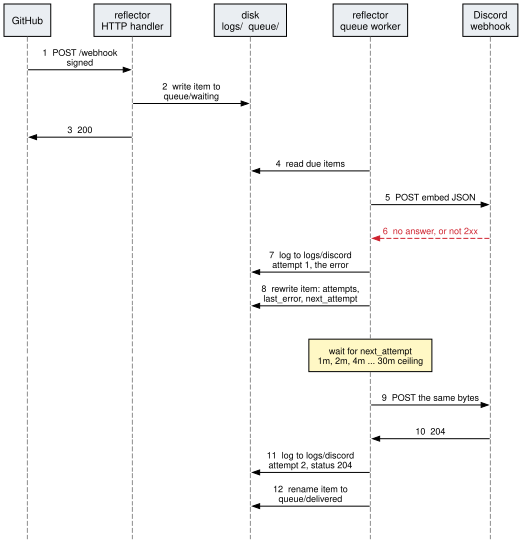
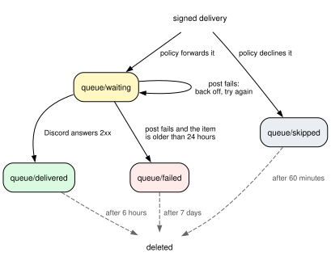

# Design

This document explains how github-reflector works inside and why it is built
the way it is. [README.md](README.md) covers what it is for and how to run it.

## Summary

github-reflector is one Go process with two halves that share nothing but a
directory on disk.

- The **HTTP handler** authenticates each GitHub delivery, decides whether it
  is worth forwarding, writes the ones that are to `queue/waiting`, and answers
  GitHub. It never talks to Discord.
- The **queue worker** reads `queue/waiting`, posts each item to Discord, and
  retries the ones that fail. It never talks to GitHub.

GitHub is answered `200` as soon as a delivery is safely on disk, so nothing
Discord does can turn into a failed delivery on the GitHub side. Everything
else follows from that split: the queue is a set of directories, an item's
state is the directory it is in, and both the service and the person running it
read the same files.

## Goals

- Forward only what somebody needs to read. On a repository with busy CI that
  is a small fraction of what GitHub sends.
- Never lose a delivery that was accepted, and never make a Discord outage
  GitHub's problem.
- Make "why did nothing appear in Discord?" answerable by looking at files,
  after the fact, without having turned anything on beforehand.
- Hold no GitHub credentials and depend on nothing outside the Go standard
  library, since the service is reachable from the internet.

It does not try to be a general webhook router. There is one inbound secret and
one Discord channel, and the service runs as a single process on a single
host.

## Components

| Component | Where | What it does |
|---|---|---|
| Caddy | [Caddyfile](Caddyfile), [compose.yaml](compose.yaml) | terminates TLS, gets the certificate, and passes `/webhook` and nothing else to the reflector |
| HTTP handler | [main.go](main.go) `handle` | reads the body, verifies the signature, parses, asks policy, enqueues or declines, answers GitHub |
| Policy | [format.go](format.go) `summarise` | turns an event and its payload into a message, or into a reason for not forwarding it |
| Queue | [queue.go](queue.go) | writes, reads and moves item files under `queue/`; computes the backoff |
| Queue worker | [main.go](main.go), a goroutine | posts due items to Discord, one at a time |
| Audit logs | [logs.go](logs.go) | appends one JSON line per inbound delivery and per outbound attempt to a file per UTC day |
| Housekeeping | [main.go](main.go), two goroutines | deletes queue items past their retention every 15 minutes, and old log files once a day |

Settings are read from the environment once, at startup. There is no
configuration reload; a changed setting takes effect when the process restarts.

## Bounce diagrams

Each diagram reads from top to bottom. A column is a participant, a solid arrow
is a message or a write, and a yellow box is work a participant does without
talking to anyone. The numbers match the notes under each diagram.

### A delivery that is forwarded



_Source: [design/bounce-forwarded.gv](design/bounce-forwarded.gv)_

1. GitHub posts the delivery over HTTPS. It carries `X-Hub-Signature-256`, an
   HMAC-SHA256 of the body keyed with the shared secret.
2. Caddy passes it to the reflector over plain HTTP on the compose network.
   The handler reads at most 5 MB, verifies the HMAC against the raw bytes in
   constant time, and only then parses the JSON. Policy returns a message, and
   the handler renders it into the exact JSON that Discord will receive.
3. The item is written to `queue/waiting`: the GitHub headers and body as
   received, and the rendered Discord payload. The write goes to a temporary
   file that is renamed into place, so the worker never sees half an item.
4. The handler nudges the worker through a channel. The nudge carries no data;
   it only means "look at the queue now".
5. One line goes to `logs/github` with the outcome `queued`.
6. GitHub is answered `200`. From here GitHub's part is over.
7. The worker lists `queue/waiting` and picks out the items whose
   `next_attempt` has arrived.
8. It posts the stored payload to the Discord webhook.
9. Discord answers `204`. Any 2xx counts as delivered.
10. One line goes to `logs/discord` with the attempt number and status.
11. The item is rewritten with Discord's response and renamed into
    `queue/delivered`.

Steps 7 to 11 normally complete within milliseconds of step 4, and may overlap
steps 5 and 6. The diagram draws them afterwards because nothing in steps 1 to
6 waits for them.

### A delivery that policy declines



_Source: [design/bounce-declined.gv](design/bounce-declined.gv)_

This is most of the traffic on a busy repository: a job that passed, a check
run that duplicates a job, an event type the service does not handle.

1. GitHub posts the delivery.
2. Caddy passes it on. It is authenticated and parsed exactly as before, and
   policy answers "do not forward" together with a reason, such as
   `job concluded success`.
3. The delivery and the reason are written to `queue/skipped`. This is a
   record, not work: the worker never reads that directory. `LOG_SKIPPED=0`
   turns the step off.
4. One line goes to `logs/github` with the outcome `ignored` and the reason.
5. GitHub is answered `204`.

Neither the worker nor Discord is involved.

### A delivery that fails authentication



_Source: [design/bounce-rejected.gv](design/bounce-rejected.gv)_

1. Somebody posts to `/webhook` with a signature that is missing, malformed or
   wrong.
2. Caddy passes it on. The handler reads the body and computes the HMAC, which
   does not match. The body is never parsed.
3. One line goes to `logs/github` with the outcome `bad_signature`, the byte
   count and the peer address.
4. The answer is `401`.

Nothing is written to `queue/`, so an unauthenticated sender can add log lines
but cannot make the service store a payload. Two other rejections follow the
same shape: a body over 5 MB is answered `413` before the signature is
checked, and a correctly signed body that is not JSON is answered `400`.

### Discord is unavailable



_Source: [design/bounce-retry.gv](design/bounce-retry.gv)_

Caddy is left out of this diagram; it does the same as before.

1. GitHub posts the delivery.
2. The item is written to `queue/waiting`.
3. GitHub is answered `200`. The service has taken responsibility for the
   delivery, and what follows is invisible to GitHub.
4. The worker reads the due items.
5. It posts the payload to Discord.
6. The post fails. A refused connection, a timeout after 15 seconds and any
   answer that is not 2xx, including a `429` rate limit, are all treated alike.
7. One line goes to `logs/discord` with the attempt number and the error.
8. The item is rewritten in place with the attempt count, the error and a
   `next_attempt` time, and stays in `queue/waiting`.
9. When `next_attempt` arrives the worker posts again. The payload was
   rendered once, in the handler, so a retry sends the same bytes, and the
   embed's timestamp is the time the delivery arrived, not the time it finally
   got through.
10. Discord answers `204`.
11. One line goes to `logs/discord` for the second attempt.
12. The item is renamed into `queue/delivered`.

The wait after the first failure is one minute, and it doubles after each
further failure up to a ceiling of 30 minutes. With the default
`RETRY_WINDOW_HOURS=24` that is about fifty attempts. An attempt that fails
when the item is older than the window moves it to `queue/failed` with its last
error, and the worker stops trying.

## The queue

A queue item is one JSON file. Its name is the time it arrived, the event type
and GitHub's delivery id, so a directory listing is in arrival order and an
item keeps its name as it moves. The state of an item is the directory it is
in, and a change of state is a rename, which is atomic within one filesystem.



_Source: [design/queue-lifecycle.gv](design/queue-lifecycle.gv)_

Retention is by state, and the times in the diagram are the defaults.
`queue/delivered` is kept only long enough for spot checks. `queue/failed` is
kept for a week because those are the items somebody has to look at.
`queue/skipped` is the bulk of the traffic and nothing is pending on it, so it
goes after an hour. An item in `queue/waiting` is also deleted if nothing has
touched it for the same week. In practice that means the service was stopped
for that long, or the file is not a readable item.

Because the worker's first act on startup is to read `queue/waiting`, a restart
needs no recovery step. Whatever was waiting is tried again.

## Policy

Policy is one function, `summarise`, which takes the event name and the parsed
payload and returns a message, a yes or no, and a reason for a no. It reads no
files and makes no network calls, so the decision for any delivery can be
reproduced from the item stored in `queue/skipped` or `queue/delivered`.

The checks run broadly in this order, and the first one that declines supplies
the reason:

1. If `ONLY_WORKFLOWS` is set, anything that is not a `workflow_run` of a
   listed workflow is declined.
2. The event type must be one the service handles.
3. The action must be one worth reporting. For the CI events that means
   `completed`.
4. The source must not be on an ignore list: `IGNORE_CHECK_APPS` for the app
   that owns a check, `IGNORE_JOB_NAMES` for a job or check name, and
   `IGNORE_WORKFLOWS` for a workflow.
5. The conclusion must not be in `IGNORE_CONCLUSIONS`, unless
   `FORWARD_SUCCESS=1`.

The defaults lean towards silence. A green job is not news, a cancelled job is
usually collateral from a sibling's failure, and a skipped job never ran. The
README's [Cutting CI noise](README.md#cutting-ci-noise) section has the
measurements behind those defaults.

## Decisions

**Answer GitHub after the disk write, not after Discord.** GitHub does not
retry a failed delivery by itself, so answering with an error during a Discord
outage would leave recovery to somebody clicking Redeliver. Taking the
delivery onto disk and answering `200` moves the retry to the one place that
can do it. The exception is deliberate: if the item cannot be written, the
answer is `502`, because then the service has not taken responsibility and
GitHub's record should say so.

**Use files, not a database or a broker.** After filtering, the volume is
small, and one process on one host is all that reads or writes it. Files need
no service to run, and the person operating it can use `ls`, `cat` and `jq`
on the same state the program uses. A rename gives an atomic change of state
with no locking. The cost is that the design does not extend to more than one
instance sharing a queue.

**Authenticate before parsing.** The HMAC is computed over the raw bytes and
compared before the JSON decoder sees them. An unauthenticated sender reaches
only the body reader, with its 5 MB cap, and the HMAC.

**Hold no GitHub credentials.** The service only receives. The signing secret
is generated by whoever runs it and grants nothing on GitHub, so a compromise
of the host exposes the signing secret, the Discord webhook and the stored
payloads, but no access to any repository.

**Render once and store the result.** The Discord payload is built in the
handler and kept in the item. The worker sends stored bytes and has no
knowledge of GitHub events at all, which keeps the two halves independent and
makes a retry identical to the first attempt.

**Record what was declined, briefly.** A filter that drops most of its input
looks the same as a broken one from the outside. Keeping each declined
delivery with its reason for an hour makes the difference visible, and the
short retention keeps the cost bounded on a busy repository. The audit log
keeps the one-line reason for 30 days.

**Standard library only.** The program is exposed to the internet and handles
untrusted input. With no third-party modules there is nothing to track for
vulnerabilities but the Go toolchain, and the build is a single static binary
in an Alpine image that otherwise holds only CA certificates.

**Put Caddy in front.** TLS, certificate renewal and the HTTP to HTTPS redirect
are Caddy's job. It routes only `/webhook`, and the reflector's port is not
published on the host.

## When things go wrong

| What happens | What the service does |
|---|---|
| Discord is down, slow or answering with errors | the item stays in `queue/waiting` and is retried with backoff; after the retry window it moves to `queue/failed` |
| The process restarts | items in `queue/waiting` are tried again on startup |
| The process is down when GitHub delivers | Caddy answers `502` and GitHub records a failed delivery; it has to be redelivered from the webhook's settings page |
| The queue directory cannot be written | the delivery is answered `502` with the outcome `queue_failed` |
| An audit log line cannot be written | the error goes to the container log and the delivery carries on |
| The process dies after Discord accepted a post but before the rename | the item is still in `queue/waiting` and is posted a second time on restart |
| A required secret is missing, or a directory cannot be created | the process logs the reason and exits at startup |

## Known limits

- **Delivery is at least once.** The crash case in the table above produces a
  duplicate message, and a delivery that somebody redelivers from GitHub is
  posted again; nothing de-duplicates on the delivery id.
- **One worker, one post at a time.** During an outage every due item costs up
  to 15 seconds before it fails, so a long list of waiting items is worked
  through slowly. Order is by arrival, except that an item waiting out a
  backoff is overtaken by newer ones.
- **Rate limits are not handled specially.** A `429` from Discord is retried
  on the ordinary backoff schedule and its `Retry-After` is not read, so a
  post that trips the limit waits at least a minute, however short a wait
  Discord asked for.
- **Paused deliveries are not replayed.** With `DISCORD_ENABLED=0` a
  forwardable delivery is recorded in `logs/discord` and never queued, so it is
  not sent when posting is switched back on.
- **One secret and one channel.** Every webhook pointed at an instance shares
  the signing secret, and everything is posted to the same Discord webhook.
- **The logged peer address is the proxy's.** Behind Caddy, the `remote` field
  of a rejected delivery is Caddy's address on the compose network.
- **A leftover temporary file is never cleaned up.** If the process dies
  between writing an item's temporary file and renaming it, the `.tmp` file
  stays in the queue directory. It is ignored by the worker and by retention.
- **`/healthz` only shows that the process is serving.** It does not check the
  queue or Discord, and Caddy does not route it.

## Regenerating the diagrams

The diagrams are drawn with [Graphviz](https://graphviz.org/). Each `.gv` file
in [design/](design/) is the source for the `.svg` beside it, and both are
committed. After editing a source, render it again:

```sh
for f in design/*.gv; do dot -Tsvg "$f" -o "${f%.gv}.svg"; done
```

Graphviz has no notion of a sequence diagram, so the bounce diagrams are laid
out as a grid. Each participant is a column of invisible nodes joined by a
dashed lifeline, each step is a row held level with `rank=same`, and a message
is an edge between two nodes in the same row. The comment at the top of
[design/bounce-forwarded.gv](design/bounce-forwarded.gv) describes the two
rules that keep the columns in order.
